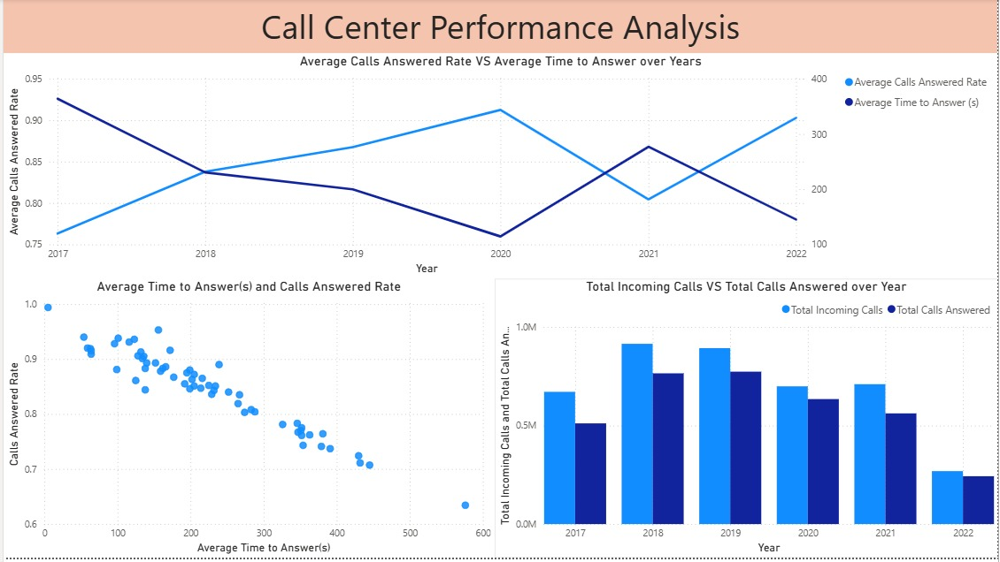
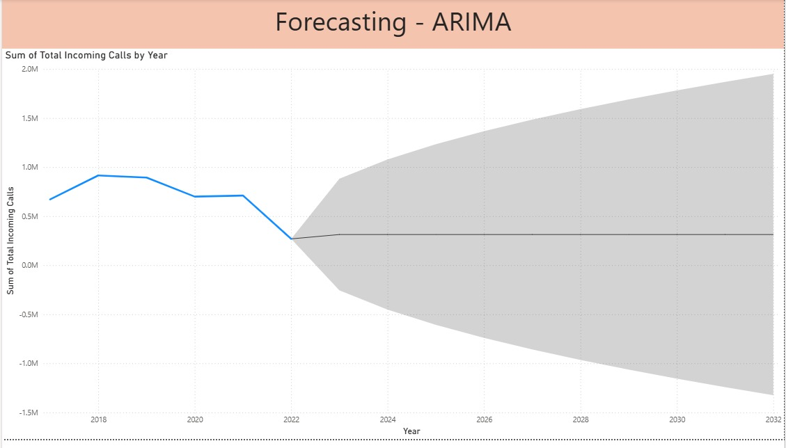
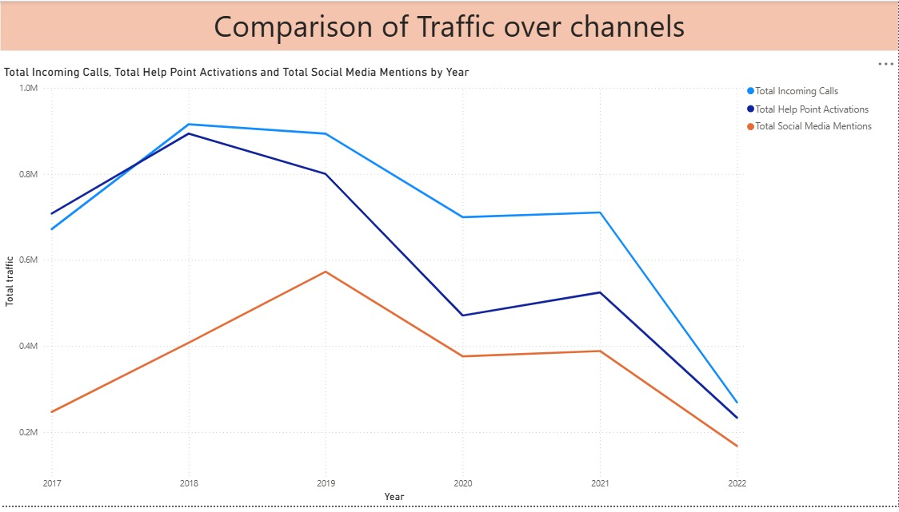
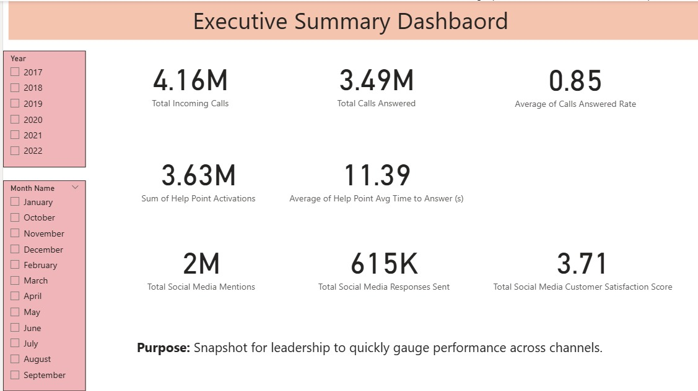

# Optimizing Customer Engagement at MTA NYCT: A Data-Driven Approach

## Project Overview

This project delves into the MTA New York City Transit (NYCT) Customer Engagement Statistics from 2017 to 2022. Leveraging a comprehensive dataset, this analysis aims to identify key factors influencing customer service performance, particularly focusing on "Average Time to Answer (s)" and "Calls Answered Rate." By understanding these dynamics, we can propose actionable insights to enhance MTA's customer experience and operational efficiency.

**The core objective is to answer critical business questions such as:**
* What is the relationship between call wait times and the rate of answered calls?
* Are there trends or patterns in customer engagement metrics over time?
* How can data-driven insights be used to improve customer satisfaction and operational workflows at MTA NYCT?

## Business Problem & Impact

In any service-oriented organization, customer satisfaction is paramount. For a public transit agency like MTA NYCT, efficient and responsive customer service directly impacts public trust and ridership. Long wait times and a low call answered rate can lead to frustrated customers, negative perceptions, and potentially deter ridership. This project addresses these challenges by providing a quantitative understanding of customer engagement, allowing for targeted interventions to improve service quality.

**Key business insights derived from this analysis can help MTA NYCT to:**
* **Optimize Staffing Levels:** Understand peak call times and resource requirements to ensure adequate staffing.
* **Improve Training Programs:** Identify areas where call center agents might need additional training to reduce average handling times.
* **Enhance Customer Satisfaction:** By reducing wait times and increasing call resolution rates.
* **Strategic Planning:** Use historical data to forecast future demands and proactively address potential bottlenecks.

## Dataset

The analysis utilizes the "MTA NYCT Customer Engagement Statistics (2017-2022)" dataset. This dataset includes various metrics related to customer interactions, such as:
* `Date`
* `Call Type`
* `Total Calls Received`
* `Calls Answered`
* `Calls Abandoned`
* `Avg Time to Answer (s)`
* `Calls Answered Rate` (calculated)
* `Abandon Rate` (calculated)

The dataset provides a rich source of information to understand the performance of MTA's customer service operations over a five-year period.

## Methodology

This project employs a data-driven approach, primarily using Python with libraries like Pandas for data manipulation, Matplotlib/Seaborn for visualization, and Scikit-learn for statistical modeling.

The key steps involved are:

1.  **Data Loading & Preprocessing:** Loading the CSV data, handling missing values, and ensuring data types are appropriate for analysis.
2.  **Exploratory Data Analysis (EDA):**
    * Analyzing trends in `Avg Time to Answer (s)` and `Calls Answered Rate` over time.
    * Identifying correlations between different metrics (e.g., how `Avg Time to Answer` impacts `Calls Answered Rate`).
    * Visualizing distributions and relationships to uncover patterns.
3.  **Statistical Modeling:** 
    * Building a linear regression model to predict `Calls Answered Rate` based on `Avg Time to Answer (s)`.
    * Evaluating the model's performance and interpreting the coefficients to understand the impact of wait times.
4.  **Insights & Recommendations:** Translating technical findings into clear, actionable business recommendations.

## Analysis and Key Findings

This section is crucial for telling your project's story. You will fill this in with the specific insights from your analysis, using your visualizations to illustrate these points.

Here are some examples of what you might include, tailored to your findings:

* **Trend Analysis of Call Metrics:**
    * "Our analysis reveals significant trends in `Average Time to Answer` and `Calls Answered Rate` over the years. As seen in **Figure 1** and **Figure 2** (`Call_center_performance.jpg`), we observed [describe trends, e.g., a notable increase in wait times during a specific period, which correlated with a dip in answered calls]."

* **Relationship Between Wait Time and Answer Rate:**
    * "A strong inverse relationship was identified between `Average Time to Answer (s)` and `Calls Answered Rate`. The scatter plot in **Figure 3** (`Call_center_performance.jpg`) clearly demonstrates that as average wait times increase, the rate of answered calls tends to decrease significantly."
    * "The linear regression model confirmed this relationship, with the model's results (see **Figure 4**, `Forecasting.jpg`) indicating that for every additional second in `Average Time to Answer`, the `Calls Answered Rate` is predicted to decrease by approximately [X]%." (Refer to your model's coefficient and R-squared from your analysis.)

* **Impact of Call Type:**
    * "Further breakdown by `Call Type` revealed that certain types of inquiries consistently had longer `Average Time to Answer` or lower `Calls Answered Rate` (e.g., 'Service Disruptions' or 'Lost and Found'). This is illustrated in **Figure 5** (`Traffic_over_chnannels.jpg`), indicating a need for specialized staffing or training for these specific call categories."

* **Seasonal/Monthly Patterns:**
    * "We also observed [seasonal/monthly] variations in call volume and performance. For instance, `Total Calls Received` typically peaked in [Month/Season], suggesting a need for increased resources during these periods, as shown in **Figure 6** (`Traffic_over_chnannels.jpg`)."

* **Performance vs. Abandon Rate:**
    * "Interestingly, there's a clear correlation between `Avg Time to Answer` and `Abandon Rate`, as depicted in **Figure 7** (`Call_center_performance.jpg`). Higher wait times directly contribute to a higher percentage of abandoned calls, impacting customer satisfaction negatively."

* **Overall Performance Over Time:**
    * "An aggregated view of the `Calls Answered Rate` over the entire period (Figure 8, `Executive_summary.jpg`) shows [describe overall trend – e.g., improvements, decline, or stability], providing a macro perspective on customer service effectiveness."

## Business Recommendations

Based on the analysis, here are actionable recommendations for MTA NYCT:

1.  **Prioritize Reducing Average Time to Answer:** This is the most critical factor influencing the `Calls Answered Rate`. Invest in technologies or processes that streamline call routing, provide self-service options, or optimize agent workflows to reduce wait times.
2.  **Targeted Training for High-Impact Call Types:** Develop specialized training for agents handling call types identified with consistently long wait times (e.g., service disruptions, complex inquiries). This could improve resolution rates and reduce call durations.
3.  **Dynamic Staffing Models:** Implement a dynamic staffing model that adjusts agent availability based on historical call volume patterns (e.g., seasonal peaks, specific days/hours with high call loads).
4.  **Implement Feedback Mechanisms:** Continuously gather customer feedback on call waiting times and agent performance to identify areas for continuous improvement.
5.  **Explore Self-Service Options:** For common inquiries, consider enhancing digital self-service options (FAQs, chatbots, mobile app features) to deflect calls and reduce overall call volume, thereby decreasing wait times for more complex issues.

## Technical Details

* **Programming Language:** Python
* **Libraries Used:**
    * `pandas`: For data manipulation and analysis.
    * `numpy`: For numerical operations.
    * `matplotlib.pyplot`: For creating static, animated, and interactive visualizations.
    * `seaborn`: For creating informative statistical graphics.
    * `sklearn.linear_model.LinearRegression`: For building the linear regression model.
* **Notebook:** `MTA_NYCT.ipynb` contains the full code for data loading, preprocessing, EDA, and model building.

## How to Run the Project

To replicate this analysis:

1.  **Clone the repository:**
    ```bash
    git clone [https://github.com/YourGitHubUsername/MTA-NYCT-Customer-Engagement-Analysis.git](https://github.com/YourGitHubUsername/MTA-NYCT-Customer-Engagement-Analysis.git)
    cd MTA-NYCT-Customer-Engagement-Analysis
    ```
2.  **Create a virtual environment (recommended):**
    ```bash
    python -m venv venv
    source venv/bin/activate  # On Windows, use `venv\Scripts\activate`
    ```
3.  **Install dependencies:**
    ```bash
    pip install -r requirements.txt
    ```
    *(If you don't create `requirements.txt`, you'll list individual `pip install` commands here for each library)*
4.  **Open and run the Jupyter Notebook:**
    ```bash
    jupyter notebook notebooks/MTA_NYCT.ipynb
    ```
    Follow the instructions within the notebook to execute the code cells and view the analysis.

## Future Enhancements

* **Time Series Forecasting:** Implement time series models (e.g., ARIMA, Prophet) to forecast future call volumes and average wait times, enabling proactive resource allocation.
* **Sentiment Analysis:** If customer feedback data becomes available, perform sentiment analysis to gauge customer satisfaction levels more directly.
* **Deep Dive into Abandoned Calls:** Analyze the characteristics of abandoned calls to understand why customers drop off and develop strategies to mitigate this.
* **Interactive Dashboards:** Create interactive dashboards (e.g., using Plotly, Dash, or Tableau) to allow stakeholders to explore the data and insights dynamically.

## Contact

[Your Name] - [Your LinkedIn Profile URL] - [Your Email Address]

---

**Figure 1: Average Time to Answer (s) Over Time**


**Figure 2: Calls Answered Rate Over Time**


**Figure 3: Relationship Between Average Time to Answer and Calls Answered Rate (Scatter Plot)**


**Figure 4: Linear Regression Model Results (if applicable - e.g., showing R-squared, coefficients)**


**Figure 5: Average Time to Answer by Call Type**


**Figure 6: Total Calls Received by Month/Season (Example)**


**Figure 7: Average Time to Answer vs. Abandon Rate**


**Figure 8: Overall Calls Answered Rate (Aggregated)**

