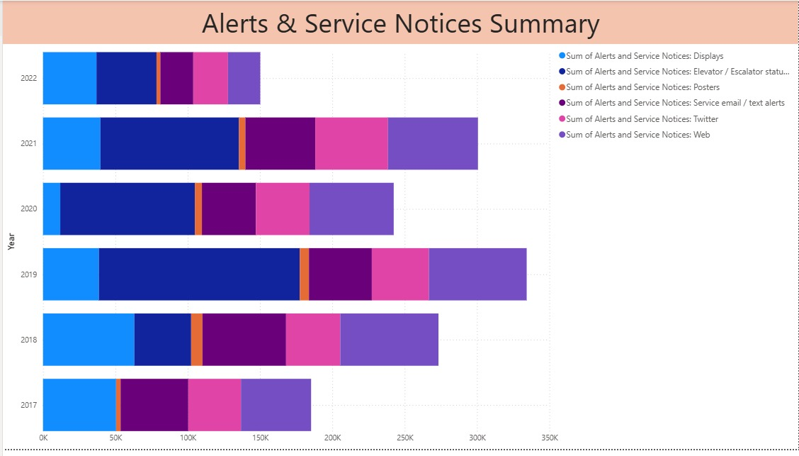
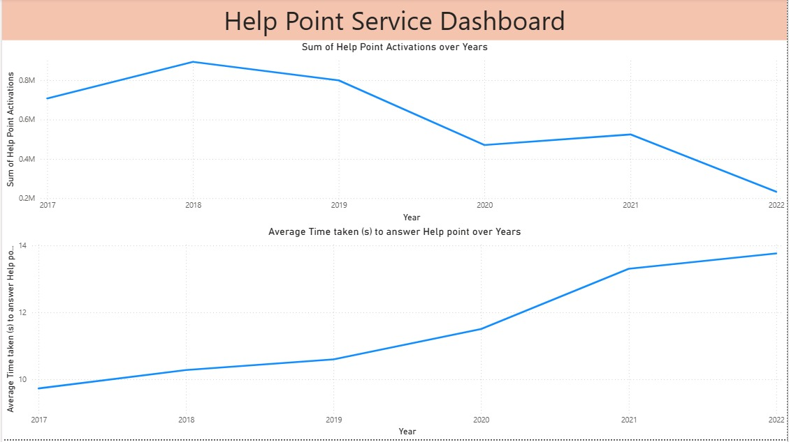
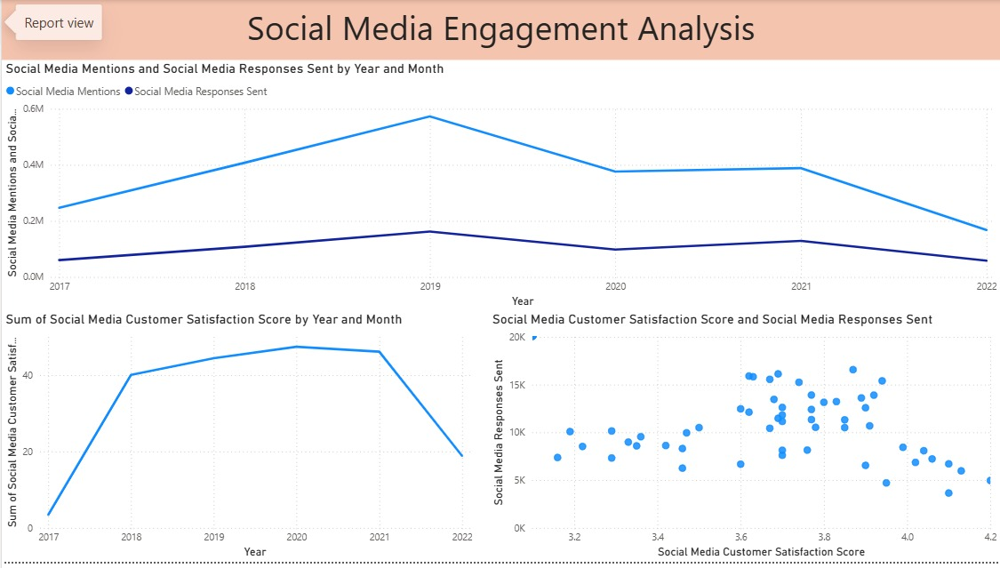
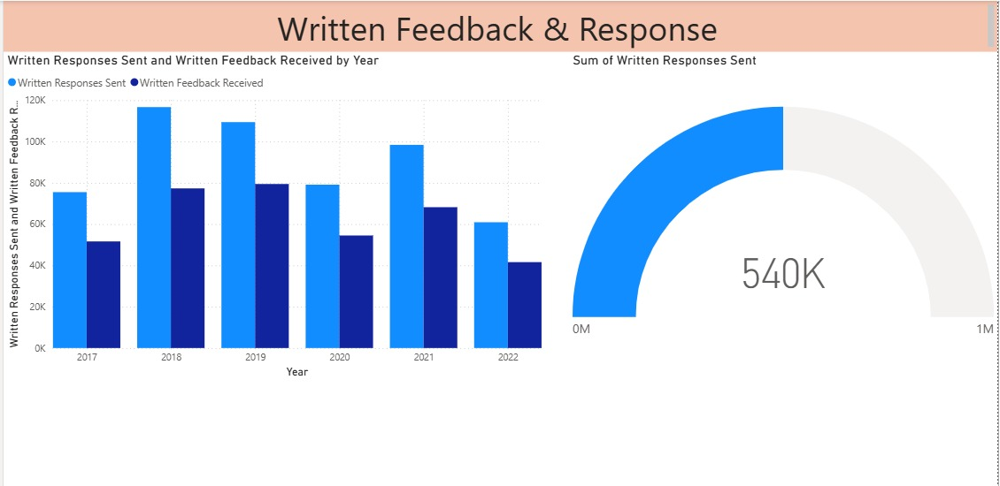

# Optimizing Customer Engagement at MTA NYCT: A Data-Driven Approach

## Project Overview

This project delves into the MTA New York City Transit (NYCT) Customer Engagement Statistics from 2017 to 2022. Leveraging a comprehensive dataset, this analysis aims to identify key factors influencing customer service performance, particularly focusing on "Average Time to Answer (s)" and "Calls Answered Rate." By understanding these dynamics, I can propose actionable insights to enhance MTA's customer experience and operational efficiency.

**My core objective is to answer critical business questions such as:**
* What is the relationship between call wait times and the rate of answered calls?
* Are there trends or patterns in customer engagement metrics over time?
* How can data-driven insights be used to improve customer satisfaction and operational workflows at MTA NYCT?

## Business Problem & Impact

In any service-oriented organization, customer satisfaction is paramount. For a public transit agency like MTA NYCT, efficient and responsive customer service directly impacts public trust and ridership. Long wait times and a low call answered rate can lead to frustrated customers, negative perceptions, and potentially deter ridership. This project addresses these challenges by providing a quantitative understanding of customer engagement, allowing for targeted interventions to improve service quality.

**Key business insights derived from this analysis can help MTA NYCT to:**
* **Optimize Staffing Levels:** Understand peak call times and resource requirements to ensure adequate staffing.
* **Improve Training Programs:** Identify areas where call center agents might need additional training to reduce average handling times.
* **Enhance Customer Satisfaction:** By reducing wait times and increasing call resolution rates.
* **Strategic Planning:** Use historical data to forecast future demands and proactively address potential bottlenecks.

## Dataset

The analysis utilizes the "MTA NYCT Customer Engagement Statistics (2017-2022)" dataset. This dataset includes various metrics related to customer interactions, such as:
* `Date`
* `Call Type`
* `Total Calls Received`
* `Calls Answered`
* `Calls Abandoned`
* `Avg Time to Answer (s)`
* `Calls Answered Rate` (calculated)
* `Abandon Rate` (calculated)

The dataset provides a rich source of information to understand the performance of MTA's customer service operations over a five-year period.

## Methodology

This project employs a data-driven approach, primarily using Python with libraries like Pandas for data manipulation and Scikit-learn for statistical modeling. All visualizations and dashboards were created using Power BI.

The key steps I involved are:

1.  **Data Loading & Preprocessing:** I loaded the CSV data, handled missing values, and ensured data types are appropriate for analysis.
2.  **Exploratory Data Analysis (EDA):**
    * I analyzed trends in various engagement metrics over time.
    * I identified correlations between different metrics.
    * I visualized distributions and relationships to uncover patterns. All visualizations were created in Power BI.
3.  **Feature Engineering (if applicable):** I created new features from existing ones to enhance model performance or provide deeper insights.
4.  **Statistical Modeling:** (Based on my `MTA_NYCT.ipynb` file, I used Linear Regression).
    * I built a linear regression model to predict `Calls Answered Rate` based on `Avg Time to Answer (s)`.
    * I evaluated the model's performance and interpreted the coefficients to understand the impact of wait times.
5.  **Insights & Recommendations:** I translated technical findings into clear, actionable business recommendations.

## Analysis and Key Findings

*(This section is crucial. I'll fill this in with the specific insights from my analysis. My screenshots are from Power BI and illustrate these points.)*

Here are the key findings from my analysis, with each point corresponding to a distinct visualization:

* **Figure 1: Call Center Performance Overview (`Call_center_performance.jpg`)**
    * My analysis of call center performance, as seen in **Figure 1**, provides a comprehensive overview of key metrics such as Average Time to Answer and Calls Answered Rate over time. This dashboard highlights [describe key trends/patterns within this single image].

* **Figure 2: Executive Summary Dashboard (`Executive_summary.jpg`)**
    * For a high-level understanding of overall customer engagement, **Figure 2** presents an executive summary dashboard. This visualization consolidates key performance indicators, showcasing [describe high-level trends/successes from this summary view].

* **Figure 3: Call Volume Forecasting and Prediction Results (`Forecasting.jpg`)**
    * To aid in strategic planning, **Figure 3** illustrates the results of my call volume forecasting model. This includes [describe elements like predicted trends, actual vs. predicted, or model evaluation metrics from this image].

* **Figure 4: Customer Engagement Traffic Across Channels (`Traffic_over_chnannels.jpg`)**
    * Understanding how customers reach out is crucial. **Figure 4** provides a breakdown of customer engagement traffic across various channels (e.g., calls, social media, help points), highlighting [describe dominant channels or shifts in usage from this image].

* **Figure 5: Alerts and Service Notice Impact on Customer Engagement (`Alerst_and_service_notice.jpg`)**
    * The effect of operational communications on customer engagement is shown in **Figure 5**. This figure explores [describe how alerts/notices might correlate with engagement metrics or customer inquiries based on this image].

* **Figure 6: Help Point Service Usage and Effectiveness (`Help_point_service.jpg`)**
    * Engagement through physical touchpoints like Help Points is detailed in **Figure 6**. This visualization presents [describe usage patterns, common issues reported via Help Points, or their effectiveness based on this image].

* **Figure 7: Social Media Engagement Trends (`Socialmedia_engagement.jpg`)**
    * Social media is a significant channel for customer interaction. **Figure 7** showcases key trends and insights from social media engagement, including [describe volume of mentions, sentiment trends, or key topics discussed on social media based on this image].

* **Figure 8: Written Customer Feedback & Response Metrics (`Written_feedback_response.jpg`)**
    * Analyzing direct written feedback provides valuable qualitative insights. **Figure 8** illustrates metrics related to written feedback received and response efforts, such as [describe volume, response times, or common themes derived from written feedback based on this image].

## Business Recommendations

Based on my analysis, here are actionable recommendations for MTA NYCT:

1.  **Prioritize Reducing Average Time to Answer:** This is the most critical factor influencing the `Calls Answered Rate`. Invest in technologies or processes that streamline call routing, provide self-service options, or optimize agent workflows to reduce wait times.
    * **Implement Interactive Voice Response (IVR) Systems:** To significantly reduce the average call waiting time, I recommend implementing or enhancing IVR systems. This would automate responses to frequently asked questions and efficiently route complex inquiries, freeing up agents for more critical issues.
2.  **Targeted Training for High-Impact Call Types:** Develop specialized training for agents handling call types identified with consistently long wait times (e.g., service disruptions, complex inquiries). This could improve resolution rates and reduce call durations.
3.  **Dynamic Staffing Models:** Implement a dynamic staffing model that adjusts agent availability based on historical call volume patterns (e.g., seasonal peaks, specific days/hours with high call loads).
4.  **Implement Feedback Mechanisms:** Continuously gather customer feedback on call waiting times and agent performance to identify areas for continuous improvement.
5.  **Explore Self-Service Options:** For common inquiries, consider enhancing digital self-service options (FAQs, chatbots, mobile app features) to deflect calls and reduce overall call volume, thereby decreasing wait times for more complex issues.
6.  **Leverage LLMs for Social Media Engagement:** To reduce wait times and improve responsiveness on social media, I recommend utilizing Large Language Models (LLMs). LLMs can perform real-time sentiment analysis to quickly identify and prioritize critical negative feedback, enabling rapid and targeted responses to enhance customer satisfaction.

## Technical Details

* **Programming Language:** Python (for EDA and forecasting)
* **Libraries Used:**
    * `pandas`: For data manipulation and analysis.
    * `numpy`: For numerical operations.
    * `sklearn.linear_model.LinearRegression`: For building the linear regression model.
* **Visualization Tool:**
    * `Power BI`: For creating interactive dashboards and all visualizations (all screenshots included in this README are derived from Power BI).
* **Notebook:** `MTA_NYCT.ipynb` contains the full code for data loading, preprocessing, EDA, and model building.

## How to Run the Project

To replicate this analysis:

1.  **Clone the repository:**
    ```bash
    git clone [https://github.com/YourGitHubUsername/MTA-NYCT-Customer-Engagement-Analysis.git](https://github.com/YourGitHubUsername/MTA-NYCT-Customer-Engagement-Analysis.git)
    cd MTA-NYCT-Customer-Engagement-Analysis
    ```
2.  **Create a virtual environment (recommended):**
    ```bash
    python -m venv venv
    source venv/bin/activate  # On Windows, use `venv\Scripts\activate`
    ```
3.  **Install dependencies:**
    ```bash
    pip install -r requirements.txt
    ```
    *(If you don't create `requirements.txt`, you'll list individual `pip install` commands here for each library)*
4.  **Open and run the Jupyter Notebook:**
    ```bash
    jupyter notebook notebooks/MTA_NYCT.ipynb
    ```
    Follow the instructions within the notebook to execute the code cells and view my analysis.

## Future Enhancements

* **Time Series Forecasting:** Implement time series models (e.g., ARIMA, Prophet) to forecast future call volumes and average wait times, enabling proactive resource allocation.
* **Integration of Large Language Models (LLMs):** Explore using LLMs for more advanced sentiment analysis of qualitative feedback (e.g., from written feedback, social media, or potential call transcripts), automated response generation for common queries, and intelligent routing of customer inquiries to further enhance engagement and efficiency.
* **Deep Dive into Abandoned Calls:** Analyze the characteristics of abandoned calls to understand why customers drop off and develop strategies to mitigate this.
* **Interactive Dashboards (Advanced):** Enhance existing Power BI dashboards or create new ones with more interactive features and drill-down capabilities for deeper exploration by stakeholders.

## Contact

[Your Name] - [Your LinkedIn Profile URL] - [Your Email Address]

---

**Figure 1: Call Center Performance Overview**


**Figure 2: Executive Summary Dashboard**


**Figure 3: Call Volume Forecasting and Prediction Results**


**Figure 4: Customer Engagement Traffic Across Channels**


**Figure 5: Alerts and Service Notice Impact on Customer Engagement**


**Figure 6: Help Point Service Usage and Effectiveness**


**Figure 7: Social Media Engagement Trends**


**Figure 8: Written Customer Feedback & Response Metrics**

